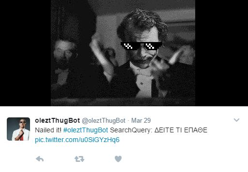
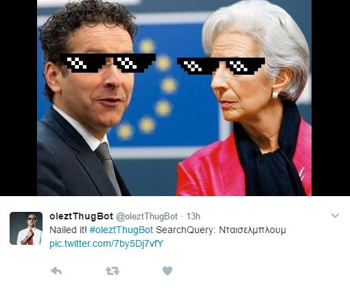

# oleztThugBot

Born Wednesday, March 29, 2017.<br>
Enjoy its tweets: https://twitter.com/oleztThugBot
```
Find a trending tweet()
If face exist:
  Add thugGlasses()
else
  Scramble and addMeme()  OR  addWastedMeme()
```


Also mention @oleztThugBot on a tweet and see what happens... (Currently disabled on Heroku)<br>
**Spoiler alert**
```
While listeningForMentions()
  answerToMentions() using user's profile picture
```

### Printscreens

<p align="center">
  
  
</p>
